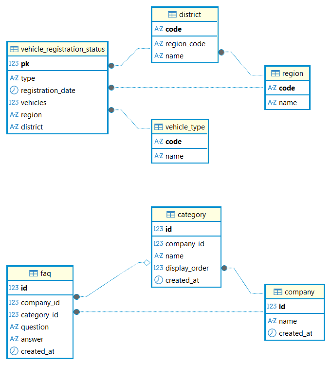

# SKN32-1st-4Team

# 🚗한국 자동차 등록 현황 및 기업 FAQ 조회 시스템

## Ⅰ. 프로젝트 목표

> 개발기간: 2026.05.15 ~ 2026.05.19   
   
- 전국 자동차 등록 현황 데이터를 제공함으로써 사용자들이 국내 차량 증가 추세 및 현황 분석
- 기업 통합 FAQ 조회 시스템을 구축하여 사용자에게 유용한 정보 제공

## 👥 팀원 소개
SK Networks AI CAMP 32기   
**Team. DataDrive**

| 신누리 | 정재희 | 이서은 | 이호원 |
|:----------:|:----------:|:----------:|:----------:|
|DB 설계<br>FAQ 크롤링|화면 기획<br>Dashboard 화면 구현|화면 기획<br>Dashboard, FAQ 화면 구현|차량 등록 현황 데이터 파싱|
| [GitHub](https://github.com/4nchez) | [GitHub](https://github.com/jjh430) | [GitHub](https://github.com/Cinccinoo) | [GitHub](https://github.com/coreawon09) |

## Ⅱ. 프로젝트 구현 사항
### 1. 전국 자동차 등록 현황 조회 🚗

국토교통부 공공데이터를 기반으로 월별 자동차 등록 현황 데이터를 조회할 수 있도록 구현함

* 월별 자동차 등록 대수 확인
* 자동차 증가 추세 분석
* 데이터 시각화를 통한 변화 흐름 확인

이를 통해 사용자는 지역별 등록 현황을 직관적으로 확인할 수 있음

### 2. 기업별 FAQ 조회 💭

선정된 자동차 브랜드의 공식 FAQ 데이터를 기반으로 사용자들이 자주 찾는 정보를 손쉽게 조회할 수 있도록 구현함

* 브랜드별 FAQ 검색 기능
* 차량 구매 및 서비스 정보 제공
* 전기차 관련 안내 정보 제공
* 자주 묻는 질문 통합 조회

이를 통해 사용자는 여러 브랜드의 공식 정보를 빠르게 탐색할 수 있으며, 필요한 정보를 보다 편리하게 확인할 수 있음


## Ⅲ. ER Diagram



### 환경설정

* MySQL 데이터베이스 8.0 이상
* DataBase 생성:
```bash
mysql -u {계정명} -p  --default-character-set=utf8mb4 < database/init.sql
```

* Python 라이브러리 설치:
```bash
pip install -r requirements.txt
```

---

## `.env` 파일 설정

- 프로젝트 실행을 위해 루트 디렉토리에 `.env` 파일 생성 필요
- `.env` 파일에 아래 환경변수 작성 필요

```dotenv
# Database 설정
DB_HOST={DB 주소}
DB_PORT={DB 포트}
DB_USER={DB 사용자명}
DB_PASSWORD={DB 비밀번호}
DB_NAME=K_Car_Navigator

# 크롤링 관련 설정
CRAWL_URLS={url,url,url}
JSON_DIR=./data/
```

### 환경 변수 설명

| 변수            | 설명                   |
| ------------- | -------------------- |
| `DB_HOST`     | 데이터베이스 서버 주소         |
| `DB_PORT`     | 데이터베이스 포트            |
| `DB_USER`     | 데이터베이스 사용자명          |
| `DB_PASSWORD` | 데이터베이스 비밀번호          |
| `DB_NAME`     | 사용할 데이터베이스 이름        |
| `CRAWL_URLS`   | 크롤링할 FAQ 페이지 URL     |
| `JSON_DIR`    | 크롤링 결과 JSON 파일 저장 경로 |

---
